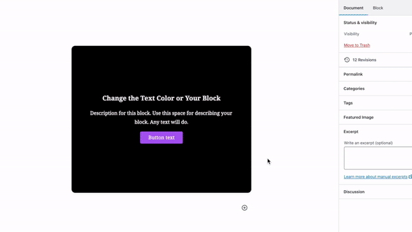
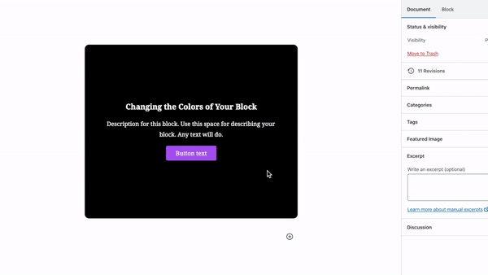
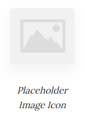
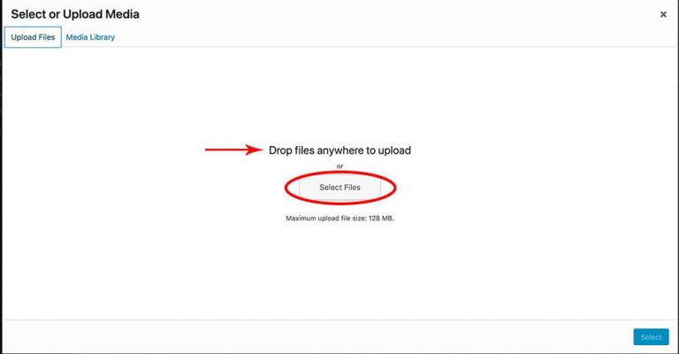
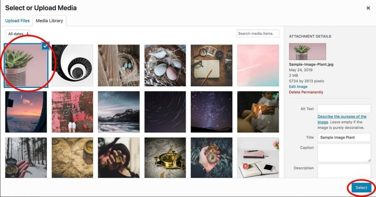
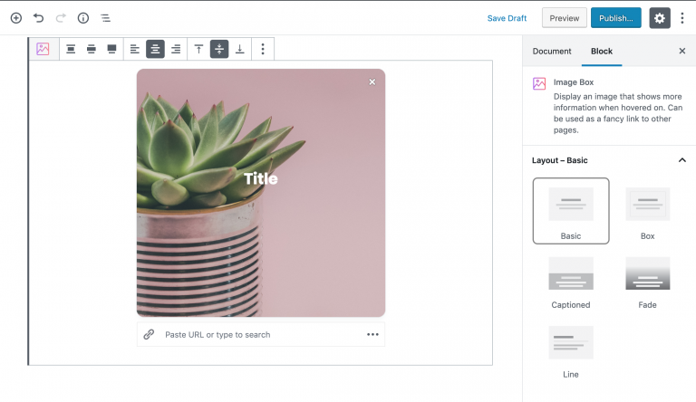
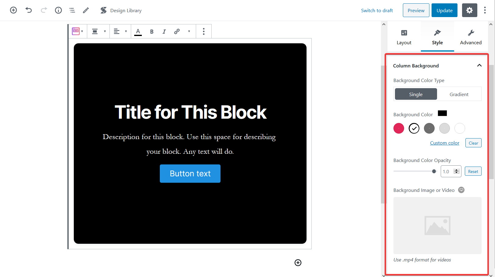

# Customizing Blocks





### **Adding or Changing Text**

* Click on the part of the Stackable block where you want to add your text and delete the placeholder text.
* The placeholder text will be grayed out when it is already deleted.
* Type in your own text.

### **Modifying Text Colors**

* Modify text colors in the **inspector.**
* Scroll to the **Color Settings** section and click the text color of the text you want to modify.
* Select colors from the palette or use the custom color picker.


You can double click on the text to immediately open its settings in the inspector.


*  You can also change the **text color or highlight selected text** form the **tool bar**.

### **Adding an Image**

* You can add images in block areas where you see a **placeholder image icon.**

* Click on block that you want to edit.
* Click the placeholder image icon where you want to add your image to open the **Select or Upload Media pop-up.**
* Upload the image you want to use by either \(1\) dropping files into the Select or Upload Media pop-up or \(2\) clicking the **Select File** button.

* The image you upload will be added to the Media Library.
* Make sure the image you want is checked, then click the **Select** button.

* Your image will then appear in your Stackable block

### **Adding an Image or Video as Background**

* There are Stackable blocks that let you add **images or** **videos** as background. These blocks will show **background settings** in the inspector.

* Click the **image icon** in the background image setting and follow the same steps as adding an image above to add images and videos in the background.

